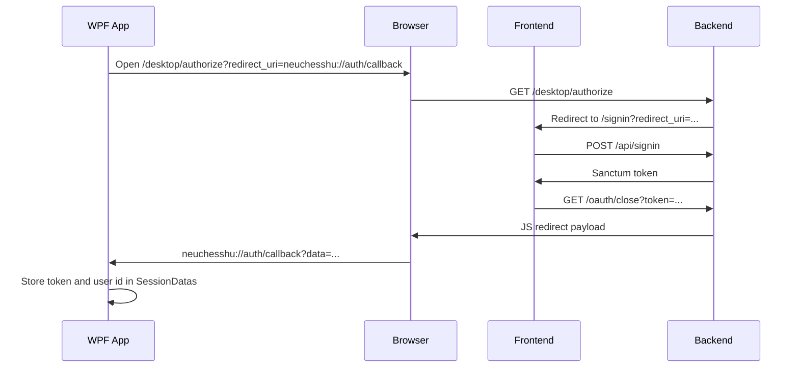
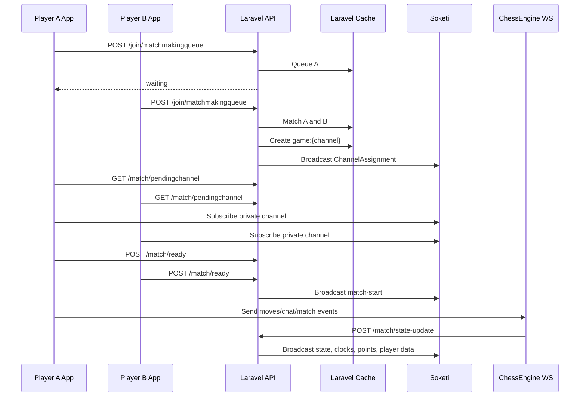

# NeuChessHu Developer Documentation

## 1. Purpose

NeuChessHu is a full-stack chess platform with:

- a public web frontend for registration, login, profiles, statistics, downloads, terms, and admin management
- a Laravel backend for REST APIs, authentication, matchmaking, match persistence, broadcasting, and chess-engine coordination
- a PHP WebSocket chess engine service for live game state processing
- a Stockfish service for bot matches
- a Windows WPF desktop application for playing matches
- a shared .NET class library for client-side API, WebSocket, chess-data, session, and patching logic

This document is based on:

- Trello export: [Trello](https://trello.com/b/W7vqmIxc)
- Web/backend repository: [GitHub](https://github.com/baranyaigabor/NeuChessHu/tree/NeuChessHu_web)
- Desktop application repository: [GitHub](https://github.com/baranyaigabor/NeuChessHu/tree/NeuChessHu_app)

The Trello board contains 242 cards across 41 lists. It covers planning, frontend, backend, desktop application, chess engine, testing, documentation, assets, database diagrams, and use cases.

## 2. High-Level Architecture

```mermaid
Flowchart LR
    User["Web user"] --> Proxy["Nginx proxy"]
    Desktop["Windows WPF app"] --> BackendAPI["Laravel API"]
    Desktop --> Soketi["Soketi / Pusher-compatible WS"]
    Desktop --> ChessEngine["Chess Engine WS :7001"]

    Proxy --> Frontend["Vue 3 frontend"]
    Proxy --> BackendAPI
    Proxy --> Docs["Docs service"]
    Proxy --> Swagger["Swagger UI"]
    Proxy --> PhpMyAdmin["phpMyAdmin"]

    BackendAPI --> MySQL["MySQL"]
    BackendAPI --> Cache["Laravel database cache"]
    BackendAPI --> Soketi
    BackendAPI --> ClamAV["ClamAV"]
    BackendAPI --> Stockfish["Stockfish service :8001"]

    ChessEngine --> MySQL
    ChessEngine --> Stockfish
    ChessEngine --> BackendAPI

    Frontend --> BackendAPI
```

The system is Docker-first on the web side. The compose stack runs the reverse proxy, frontend, backend, MySQL, phpMyAdmin, docs, Swagger UI, Stockfish, Soketi, chess engine WebSocket service, and ClamAV.

## 3. Architecture Diagrams

### 3.1 Entity-Relationship / EK Diagram


### 3.2 Database UML Diagram


### 3.3 Site User Use Case


### 3.4 Application User Use Case


### 3.5 Admin User Use Case


## 4. Repositories

### 4.1 Web Repository

Path: [Github](https://github.com/baranyaigabor/NeuChessHu/tree/NeuChessHu_web)

Important folders:

| Path | Purpose |
| --- | --- |
| `frontend/` | Vue 3 single-page application |
| `backend/` | Laravel 12 API and game backend |
| `backend/app/ChessLogic/` | PHP chess domain logic used by backend and engine |
| `backend/app/WebSocket/` | Chess engine WebSocket server entry point |
| `stockfish/` | Stockfish service container |
| `docs/` | User-facing docs content |
| `swagger/openapi.yaml` | OpenAPI spec for Users and Matches |
| `testing/` | Bruno API/WebSocket tests and test documentation |
| `architecture/` | Planning PDFs and database/use-case SVG diagrams |
| `proxy/` and `webserver/` | Nginx configuration |

### 4.2 Desktop Repository

Path: `/NeuChessHu`

Important folders:

| Path | Purpose |
| --- | --- |
| `NeuChessHu/` | WPF desktop application |
| `ChessMechanics/` | Shared .NET class library |
| `ChessMechanics.Test/` | NUnit tests for shared mechanics |

## 5. Technology Stack

### 5.1 Frontend

- Vue 3
- Vite
- Vue Router with auto-routes
- Pinia with persisted state
- Axios
- Tailwind CSS 4
- Reka UI style components
- Vue I18n
- Unovis and Chart.js for statistics
- Lucide Vue icons

### 5.2 Backend

- PHP 8.2+
- Laravel 12
- Laravel Sanctum authentication
- MySQL 9.3
- Pusher-compatible broadcasting through Soketi
- Ratchet RFC6455 and ReactPHP for the chess engine WebSocket service
- ClamAV for uploaded profile-picture scanning
- Stockfish as a separate service

### 5.3 Desktop Application

- .NET 9
- WPF
- Microsoft.Extensions dependency injection and configuration
- PusherClient
- Websocket.Client
- NAudio
- SharpVectors
- NUnit tests in `ChessMechanics.Test`

## 6. Deployment and Local Setup

<a id="zero-to-running-checklist"></a>

### 6.1 Zero-to-Running Checklist

The web project can be started from a clean machine using this checklist.

Prerequisites:

- Docker Desktop or Docker Engine with Docker Compose
- Bash-compatible terminal
- Git or a local copy of the repository
- Optional: entries for `*.vm2.test` hostnames if the local environment does not already resolve them

Expected hostnames:

```text
frontend.vm2.test
backend.vm2.test
docs.vm2.test
pma.vm2.test
```

Add the hostnames to the local hosts file and point them to, if you want to run the stack locally: `127.0.0.1`, or if you want to use our server with our vpn that we provide, 10.1.3.33.

Clean startup from zero:

```bash
cd /NeuChessHu-web
sh ./start.sh
docker compose exec backend php artisan migrate:fresh --seed
```

The `start.sh` script creates `.env`, creates shared package-manager volumes, installs frontend dependencies, starts the containers, installs Composer dependencies, runs migrations, and generates `APP_KEY` when needed.

The seed command adds the built-in bot, admin account, and sample users. Run it after the first startup or after rebuilding the database from scratch.

Quick health checks:

```bash
docker compose ps
docker compose exec backend php artisan migrate:status
```

Open these URLs in the browser:

| URL | Expected result |
| --- | --- |
| `http://frontend.vm2.test` | Vue frontend loads |
| `http://backend.vm2.test/api/users/Stockfish` | JSON response for the Stockfish bot user |
| `http://docs.vm2.test` | Documentation site loads |
| `http://pma.vm2.test` | phpMyAdmin loads |
| `http://swagger.vm2.test` | swagger |

If the frontend cannot call the backend, check `VITE_BACKEND_URL` in `.env`. If live match events do not arrive, check the Pusher/Soketi variables in [Environment Configuration](#7-environment-configuration).

### 6.2 Web Stack Startup

From `/NeuChessHu-web`:

```bash
./start.sh
```

The startup script:

1. Creates `.env` from `.env.example` when missing.
2. Creates shared Docker volumes for pnpm and Composer.
3. Installs frontend dependencies with pnpm.
4. Starts Docker Compose.
5. Installs Composer dependencies inside the backend container.
6. Runs Laravel migrations.
7. Generates `APP_KEY` when needed.

### 6.3 Stop and Remove

```bash
docker compose stop
```

```bash
docker compose down -v
```

`docker compose down -v` also removes volumes, including database data.

### 6.4 Main Local Hosts

The project is configured around VM-style hostnames:

| Host | Purpose |
| --- | --- |
| `frontend.vm2.test` | Vue frontend |
| `backend.vm2.test` | Laravel backend |
| `docs.vm2.test` | Documentation site |
| `pma.vm2.test` | phpMyAdmin |
| `swagger.vm2.test` | swagger |
| | |
| `soketi:6001` | internal Soketi broadcasting service |
| `chessengine:7001` | chess engine WebSocket service |
| `stockfish:8001` | internal Stockfish service |

<a id="environment-configuration"></a>

## 7. Environment Configuration

The root `.env.example` contains the shared Laravel, Vite, Docker, database, Pusher/Soketi, and Stockfish settings.

Important variables:

```env
APP_NAME=NeuChessHu
APP_ENV=local
APP_URL=http://backend.vm2.test/api/

VITE_FRONTEND_URL=frontend.vm2.test
VITE_BACKEND_URL=http://backend.vm2.test/api/
DOCS_URL=docs.vm2.test
VITE_DOCS_URL=docs.vm2.test

DB_CONNECTION=mysql
DB_HOST=db
DB_PORT=3306
DB_DATABASE=laravel
DB_USERNAME=laravel
DB_PASSWORD=

BROADCAST_CONNECTION=pusher
PUSHER_APP_ID=
PUSHER_APP_KEY=
PUSHER_APP_SECRET=
PUSHER_APP_CLUSTER=eu
PUSHER_PORT=6001
PUSHER_SCHEME=http
PUSHER_HOST=soketi

SOKETI_APP_ID="${PUSHER_APP_ID}"
SOKETI_APP_KEY="${PUSHER_APP_KEY}"
SOKETI_APP_SECRET="${PUSHER_APP_SECRET}"

STOCKFISH_URL=http://stockfish:8001
```

<a id="pusher-soketi-values"></a>

### 7.1 Pusher/Soketi Values

```env
PUSHER_APP_ID=2094556
PUSHER_APP_KEY=050fddd54b732a7d4754
PUSHER_APP_SECRET=<stored in pusher-env-values.rtf, do not commit>
```

The desktop application also stores the public Pusher client config at `/NeuChessHu/Resources/ConfigFiles/PusherConfig.json`:

```json
{
  "Pusher": {
    "AppKey": "050fddd54b732a7d4754",
    "Cluster": "eu",
    "Encrypted": false
  }
}
```

## 8. Docker Services

| Service | Role |
| --- | --- |
| `proxy` | Main Nginx reverse proxy on port 80 |
| `frontend` | Vue/Vite app container |
| `backend` | Laravel API container |
| `webserver` | Nginx serving backend/webserver config |
| `db` | MySQL database |
| `phpmyadmin` | Database administration UI |
| `docs` | Documentation site |
| `swagger` | Swagger UI for `openapi.yaml` |
| `stockfish` | Stockfish engine HTTP service |
| `soketi` | Pusher-compatible WebSocket/broadcasting service |
| `chessengine` | PHP chess engine WebSocket server on port 7001 |
| `clamav` | Virus scanning service |

## 9. Database Model

<a id="seeded-users"></a>

### 9.1 Seeded Users

Seeder:

```text
NeuChessHu-web/backend/database/seeders/UserSeeder.php
```

The seed data is loaded with:

```bash
docker compose exec backend php artisan db:seed --class=UserSeeder
```

Seeded accounts:

| Nickname | Email | Password | Role | Notes |
| --- | --- | --- | --- | --- |
| `Stockfish` | `stockfish@neuchess.local` | `stockfishBot` | `bot` | Internal bot user for Stockfish matches; not intended for normal login |
| `Admin` | `authsupport@neuchess.hu` | `neupass2026` | `admin` | Admin dashboard account |
| `LemonShark007` | `adam.olah06@gmail.com` | `lemonTeszt` | `user` | Sample user |
| `iBoogie` | `baranyaigl06@gmail.com` | `bgaborTeszt` | `user` | Sample user |
| `user01` | `user01@test.hu` | `test123` | `user` | Generic test user |
| `user02` | `user02@test.hu` | `test123` | `user` | Generic test user |

For public documentation, prefer the generic test users and the admin account. The two named sample users come from the project seeder and should be changed before production.

### 9.2 Users

Migration: `/backend/database/migrations/2026_04_13_153629_create_users_table.php`

Fields:

| Field | Type | Notes |
| --- | --- | --- |
| `id` | integer | Primary key |
| `nickname` | string(14) | Unique public name |
| `email` | string(255) | Unique login email |
| `password` | string(255) | Hashed password |
| `role` | string | Defaults to `user`; also used for `admin` and `bot` |
| `first_name` | string nullable | Optional profile data |
| `last_name` | string nullable | Optional profile data |
| `region` | string nullable | Optional country/region |
| `profile_picture` | longText nullable | Base64/data URL profile image |
| `date_of_birth` | date nullable | Optional profile data |
| `is_active` | boolean | Online/offline state |
| timestamps | datetime | Laravel timestamps |
| soft deletes | datetime | Soft delete support |

### 9.3 Matches

Migration: `/backend/database/migrations/2026_04_14_153649_create_matches_table.php`

Fields:

| Field | Type | Notes |
| --- | --- | --- |
| `match_id` | string | Primary key |
| `white_id` | foreign id | References `users.id` |
| `black_id` | foreign id | References `users.id` |
| `gamemode` | string | Bullet, Blitz, or Rapid |
| `match_duration` | string | Duration value such as `3`, `5`, `10`, or `3|2` |
| `played_at` | datetime | Match start date/time |
| `moves` | json nullable | Serialized SAN move rows |
| `match_end_result` | string | Checkmate, Resign, Timeout, etc. |
| `winner_id` | string nullable | Winning user id when applicable |
| `winner_time` | string nullable | Winner remaining time |

### 9.4 Matchmaking Queue

Migration: `/backend/database/migrations/2026_04_15_210343_create_matchmaking_queues_table.php`

Fields:

| Field | Type | Notes |
| --- | --- | --- |
| `id` | integer | Primary key |
| `player_id` | string unique | Queued player |
| `match_duration` | string | Requested duration |
| `joined_at` | timestamp | Queue entry time |

<a id="backend-api"></a>

## 10. Backend API

API base URL:

```text
http://backend.vm2.test/api/
```

OpenAPI file:

```text
/Users/boss/Downloads/NeuChessHu-web/swagger/openapi.yaml
```

### 10.1 User Endpoints

| Method | Path | Purpose | Auth |
| --- | --- | --- | --- |
| `GET` | `/api/users` | List users | Sanctum + `manage-users` |
| `POST` | `/api/users` | Create/register user | Public |
| `GET` | `/api/users/{user}` | Show user by id or nickname | Public for user/bot profiles |
| `PUT/PATCH` | `/api/users/{user}` | Update user | Sanctum + policy |
| `DELETE` | `/api/users/{user}` | Delete user | Sanctum + policy |
| `GET` | `/api/user` | Show current authenticated user | Sanctum |

### 10.2 Match Endpoints

| Method | Path | Purpose | Auth |
| --- | --- | --- | --- |
| `GET` | `/api/matches` | List matches | Public |
| `POST` | `/api/matches` | Store match | Sanctum + policy |
| `GET` | `/api/matches/{match}` | Show match | Public, documented in OpenAPI |

### 10.3 Authentication and Session Endpoints

| Method | Path | Purpose |
| --- | --- | --- |
| `POST` | `/api/signin` | Web login, returns Sanctum token and user |
| `POST` | `/api/logout` | Web logout, deletes current token |
| `GET` | `/desktop/authorize` | Starts desktop OAuth-style login flow |
| `GET` | `/oauth/close` | Browser close/redirect bridge for desktop callback |
| `POST` | `/api/desktop/logout` | Desktop logout |

### 10.4 Matchmaking and Live Match Endpoints

| Method | Path | Purpose |
| --- | --- | --- |
| `POST` | `/api/join/matchmakingqueue` | Join matchmaking or create Stockfish match |
| `POST` | `/api/leave/matchmakingqueue` | Leave matchmaking |
| `POST` | `/api/broadcasting/auth` | Authenticate private broadcast channels |
| `POST` | `/api/match/ready` | Mark a user ready for a channel |
| `GET` | `/api/match/pendingchannel` | Fetch pending channel assignment |
| `POST` | `/api/match/state-update` | Broadcast match state from engine |
| `POST` | `/api/match/chat-update` | Broadcast chat updates from engine |

## 11. Authentication Flow

### 11.1 Web Login

1. Frontend posts credentials to `/api/signin`.
2. Laravel validates through `AuthRequest`.
3. `Auth::attempt()` verifies credentials.
4. User `is_active` is set to true.
5. A Sanctum token is created.
6. Token and user data are returned to the frontend.

### 11.2 Desktop Login



The desktop protocol is registered as `neuchesshu://`.

## 12. Matchmaking and Game Flow

### 12.1 Player vs Player



### 12.2 Stockfish Match

When `stockfishDepth` is sent to `/api/join/matchmakingqueue`, the queue is bypassed:

1. Existing queue row for the player is removed.
2. `MatchService::startStockfishMatch()` creates a match against the Stockfish bot user.
3. The channel is assigned only to the requesting player.
4. The game cache contains Stockfish metadata.
5. Chat and draw offers are hidden in the desktop UI for Stockfish games.
6. Stockfish games are not persisted to the `matches` table by `saveMatchToDB()`.

## 13. Chess Engine

The chess engine WebSocket server starts from:

```text
backend/app/WebSocket/ChessEngineServer.php
```

It bootstraps Laravel, configures database-backed cache, creates `ChessEngine`, and listens on:

```text
0.0.0.0:7001
```

Main engine dependencies:

- `MoveComponentsFactory`
- `MoveValidatorFactory`
- `MoveFactory`
- `ChatMessagesHandlerFactory`
- `StockfishService`

Important chess logic folders:

| Path | Purpose |
| --- | --- |
| `ChessLogic/ChessBoard/` | Board creation |
| `ChessLogic/Moving/` | Move processing |
| `ChessLogic/Moving/Factories/` | Move and validator factories |
| `ChessLogic/Moving/Captures/` | Captured piece handling |
| `ChessLogic/MatchDatas/` | Game state data stores |
| `ChessLogic/Notations/` | SAN notation rows and generation |
| `ChessLogic/Messaging/` | Chat handling and moderation |

## 14. Broadcasting

Laravel broadcasts live game updates through Pusher-compatible Soketi channels.

Main events:

| Event class | Purpose |
| --- | --- |
| `ChannelAssignment` | Tells a player which private match channel to join |
| `MatchStarted` | Sends initial state, clocks, and player ids |
| `PlayerDatasUpdated` | Sends names, profile pictures, captured pieces, clocks-related player state |
| `MatchStateUpdated` | Sends board state and notation data |
| `MatchPointsUpdated` | Sends win/loss/draw/abort state |
| `ClocksUpdated` | Sends clock updates |
| `ChatMessagesUpdated` | Sends chat messages |
| `MatchStartFailed` | Tells desktop clients to reset and retry |

The desktop application subscribes through `MatchController.SubscribeMatchChannelsAsync()` and patches local state through the `Patcher` class.

## 15. Frontend Application

### 15.1 Structure

| Path | Purpose |
| --- | --- |
| `src/pages/index.vue` | Welcome route |
| `src/pages/signin/index.vue` | Sign-in route |
| `src/pages/signup/index.vue` | Registration credentials route |
| `src/pages/personal-information/index.vue` | Registration profile info route |
| `src/pages/confirmation/index.vue` | Registration confirmation route |
| `src/pages/user/[nickname].vue` | Public profile route |
| `src/pages/admin/index.vue` | Admin route |
| `src/components/layout/` | Page-level layouts |
| `src/components/ui/` | Reusable UI components |
| `src/stores/UserStore.mjs` | Pinia user and users stores |
| `src/utils/http.mjs` | Axios API instance |
| `src/utils/validation.mjs` | Shared form validation |
| `src/locales/` | English and Hungarian translations |

### 15.2 Frontend Routes

Routes are generated by `unplugin-vue-router`. Route titles are set in `src/router/index.js`.

| Route name | Page | Purpose |
| --- | --- | --- |
| `welcome` | `/` | Landing/welcome page |
| `signin` | `/signin` | Login |
| `signup` | `/signup` | Registration step 1 |
| `personalinformation` | `/personal-information` | Registration step 2 |
| `confirminformation` | `/confirmation` | Registration step 3 |
| `user` | `/user/:nickname` | Profile |
| `admin` | `/admin` | Admin user list and editing |

### 15.3 State Management

`UserStore.mjs` contains:

- authenticated token
- authenticated user
- registration step data
- user registration
- login/logout
- profile fetch/update/delete
- admin user list/update flows

The store persists to `sessionStorage`.

## 16. Desktop Application

### 16.1 Projects

| Project | Purpose |
| --- | --- |
| `NeuChessHu` | WPF UI application |
| `ChessMechanics` | Shared .NET domain/client library |
| `ChessMechanics.Test` | NUnit test project |

### 16.2 WPF Application Areas

| Area | Important classes |
| --- | --- |
| Main window | `MainWindowViewModel`, `MainWindow.xaml.cs` |
| Navigation | `NavBarViewModel`, `NavBarView` |
| Menu board | `MenuBoardViewModel`, `MenuSideBarViewModel` |
| Match board | `MatchBoardViewModel`, `BoardInteractionHandler` |
| Match side bar | `MatchSideBarViewModel`, `CapturedPiecesDisplay`, `ChatMessageDisplay` |
| Menu overlays | `LoginPopUpViewModel`, `MenuPopUpViewModel`, `TimeSetterWindowViewModel`, `LookingForMatchWindowViewModel` |
| Match overlays | `OptionsPopUpViewModel`, `PromotionWindowViewModel`, `MatchEndWindowViewModel` |
| Settings | `SettingsPopUpViewModel`, `BindableSettings` |
| Sounds | `Sounds` |

### 16.3 Shared ChessMechanics Library

Important areas:

| Path | Purpose |
| --- | --- |
| `APIs/APIHandlers.cs` | HTTP calls to Laravel API |
| `Authentication/` | Session and login callback data |
| `ChessBoard/` | Board and piece definitions |
| `MatchData/` | Clock, DTO, patching, and client match state |
| `WebSockets/Pusher/` | Pusher client service |
| `WebSockets/ChessEngine/` | Chess engine WebSocket client |
| `Common/ObservableBase.cs` | MVVM property-change base |

### 16.4 Desktop Client API Calls

`APIHandlers` uses:

```text
http://backend.vm2.test/api/
```

It provides calls for:

- fetch user by id
- join matchmaking queue
- leave matchmaking queue
- desktop logout
- broadcast channel authentication
- mark match ready
- get pending match channel

## 17. Assets

### 17.1 Branding


### 17.2 Desktop Icons

| Asset | Preview | Use |
| --- | --- | --- |
| Bullet icon |  | Bullet duration option |
| Blitz icon |  | Blitz duration option |
| Rapid icon |  | Rapid duration option |
| Chat icon |  | Match chat toggle |
| Options icon |  | Match options |
| Medal icon |  | Match result winner |

### 17.3 Piece Theme Preview

| White king | White queen | Black king | Black queen |
| --- | --- | --- | --- |
|  |  |  |  |

### 17.4 Sound Assets

The desktop app stores WAV sounds in:

```text
NeuChessHu/Resources/Sounds/
```

## 18. Trello Planning Summary

The Trello board represents the implementation plan and work breakdown.

Major work areas:

- GitHub setup
- application planning
- frontend planning
- website planning
- database planning
- raw assets
- desktop class library
- desktop GUI foundations
- desktop main components
- desktop windows and overlays
- frontend foundations
- external UI components and layouts
- navigation bar
- welcome, sign-in, sign-up, personal information, confirmation, user, and admin pages
- backend foundations
- users and matches APIs
- authentication/authorization
- chess engine
- move validation
- draw validation
- data storage and match starting
- application, backend, frontend, endpoint, WebSocket, and move testing
- final documentation

<a id="testing"></a>

## 19. Testing

The repository already contains written test documentation and test record files:

| Area | Test documentation | Test record |
| --- | --- | --- |
| Backend | `/NeuChessHu-web/testing/docs/backend/Backend_Tesztelesi_Dokumentacio.md` | `/NeuChessHu-web/testing/docs/backend/NeuChess_TesztJegyzokonyv_backend.xlsx` |
| Frontend | `/NeuChessHu-web/testing/docs/frontend/Frontend_Tesztelesi_Dokumentacio.md` | `/NeuChessHu-web/testing/docs/frontend/NeuChess_TesztJegyzokonyv_frontend.xlsx` |
| Desktop application | `/NeuChessHu-web/testing/docs/application/Alkalmazas_Tesztelesi_Dokumentacio.md` | `/NeuChessHu-web/testing/docs/application/NeuChess_TesztJegyzokonyv_alkalmazas.xlsx` |

Recommended verification order after a fresh setup:

1. Start the full web stack with [Zero-to-Running Checklist](#61-zero-to-running-checklist).
2. Seed users with [Seeded Users](#91-seeded-users).
3. Run backend PHPUnit tests.
4. Run Bruno endpoint/WebSocket tests when manual API verification is needed.
5. Run .NET desktop/shared library tests.
6. Record the results in the matching test record workbook.

### 19.1 Backend Tests

Backend PHPUnit tests are under:

```text
/NeuChessHu-web/backend/tests/
```

Covered areas include:

- chess board factory
- piece movement validation for pawn, rook, knight, bishop, queen
- SAN notation generation
- insufficient material draw validation
- match data store
- match service
- chat message handling and validation
- base64 image validation

Run inside the backend container:

```bash
cd /NeuChessHu-web
docker compose exec backend php artisan test
```

The backend test documentation and record workbook are:

```text
NeuChessHu-web/testing/docs/backend/Backend_Tesztelesi_Dokumentacio.md
NeuChessHu-web/testing/docs/backend/NeuChess_TesztJegyzokonyv_backend.xlsx
```

### 19.2 Bruno API and WebSocket Tests

Bruno collections are under:

```text
NeuChessHu-web/testing/backend-testing/
```

Covered areas:

- `/users` endpoints
- `/matches` endpoints
- Soketi WebSocket service
- ChessEngine WebSocket service

Open the collection in Bruno from:

```text
NeuChessHu-web/testing/backend-testing/
```

Use the environment files in:

```text
NeuChessHu-web/testing/backend-testing/environments/
```

### 19.3 Desktop Tests

Desktop/shared library tests are under:

```text
NeuChessHu/ChessMechanics.Test/
```

Covered areas:

- session data
- login callback data
- session manager
- observable base
- chess board factory
- chess piece basics
- clock handling
- DTOs
- patcher
- match data store
- JSON converters

Run from `/NeuChessHu`:

```bash
cd /NeuChessHu
dotnet test
```

The desktop/application test documentation and record workbook are:

```text
NeuChessHu-web/testing/docs/application/Alkalmazas_Tesztelesi_Dokumentacio.md
NeuChessHu-web/testing/docs/application/NeuChess_TesztJegyzokonyv_alkalmazas.xlsx
```

### 19.4 Frontend Manual Test Documentation

Frontend tests are documented under:

```text
NeuChessHu-web/testing/docs/frontend/Frontend_Tesztelesi_Dokumentacio.md
NeuChessHu-web/testing/docs/frontend/NeuChess_TesztJegyzokonyv_frontend.xlsx
```

The Trello board lists manual frontend test coverage for:

- welcome page
- sign-in page
- sign-up page
- personal information page
- confirmation page
- user page

Before recording frontend test results, start the web stack from zero and verify the seeded accounts can log in.

<a id="build-and-publish"></a>

## 20. Build and Publish

### 20.1 Frontend

From `/NeuChessHu-web/frontend`:

```bash
pnpm install
pnpm run build
```

### 20.2 Backend

From the backend container or `/NeuChessHu-web/backend`:

```bash
composer install
php artisan migrate
php artisan test
```

### 20.3 Desktop

From `/NeuChessHu`:

```bash
dotnet build NeuChessHu.slnx
dotnet test
```

The WPF project targets `net9.0-windows` and copies sounds, config files, and piece themes to build/publish output.

## 21. Development Notes

- Use the Docker stack for the web/backend system because the service names and URLs are coupled through Docker networking.
- Keep `.env` values local. Never commit generated app keys, database passwords, or Pusher secrets.
- The desktop client depends on `backend.vm2.test`, `frontend.vm2.test`, and the `neuchesshu://` protocol callback.
- Player-vs-player matches are saved to MySQL unless the game is aborted.
- Stockfish matches are created through the same match cache flow but are not persisted as normal match history.
- The public profile can be fetched by nickname or numeric id.
- Admin listing requires Sanctum authentication and `manage-users` authorization.
- Chat moderation is handled by backend chess logic and returns violation feedback to the desktop client.
- Profile picture upload uses base64 image validation and ClamAV scanning.

- Login datas and vpn are stored: [Drive](https://drive.google.com/file/d/1M0sNi8yjEA8oecccynu80Jq2pt9xj0Q0/view?usp=sharing)